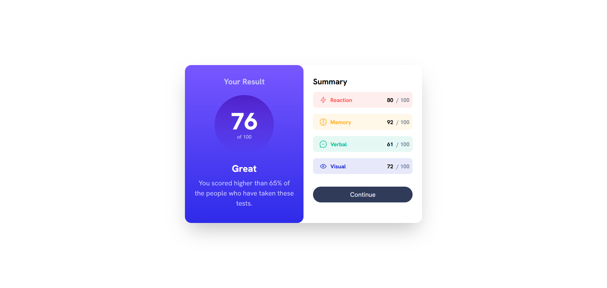
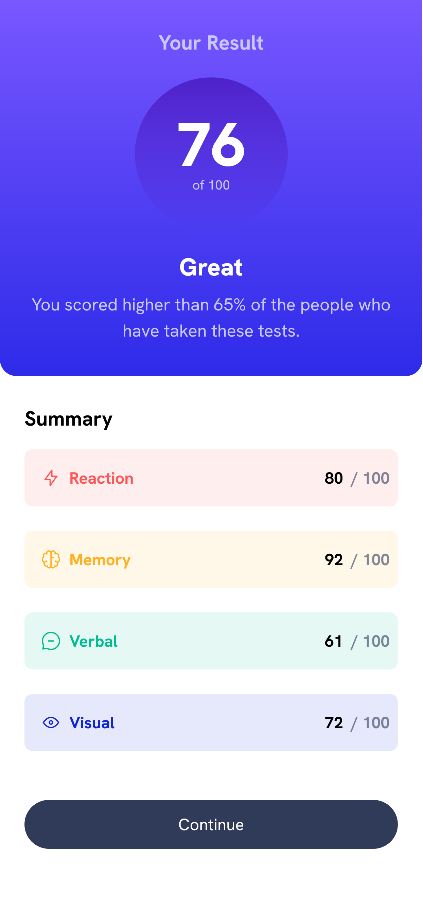

# Frontend Mentor - Product Preview Card component solution

This is a solution to the [Product preview card component challenge on Frontend Mentor](https://www.frontendmentor.io/challenges/product-preview-card-component-GO7UmttRfa). Frontend Mentor challenges help you improve your coding skills by building realistic projects. 

## Table of contents

- [Overview](#overview)
  - [Screenshot](#screenshot)
  - [Links](#links)
- [My process](#my-process)
  - [Built with](#built-with)
  - [What I learned](#what-i-learned)
  - [Continued development](#continued-development)
- [Author](#author)
- [Acknowledgments](#acknowledgments)

## Overview

### Screenshot


This is a screenshot of the page when viewed through desktop Firefox browser. However, when it is opened through other browser such as Microsoft Edge the styling becomes weird.



This is a screenshot of the page when viewed through Firefox browser, mobile view.

### Links

- Solution URL: [Github](https://github.com/anneelv/fem_ressummary)

## My process

### Built with

- HTML
- Tailwind CSS
- Next.js

### What I learned

In this project I learned to style both desktop view and mobile view in one go using the ```sm md lg``` screen breakpoint. It is still confusing but I think I started to get the hang of it.


### Continued development

I would like to change several things such as the smaller price that is should be in a different position and make it more responsive when viewed through a different browser.

## Author

- Frontend Mentor - [@anneelv](https://www.frontendmentor.io/profile/anneelv)

## Acknowledgments

Thanks to tailwind CSS documentation to help me learn about the CSS attributes to create this project.
